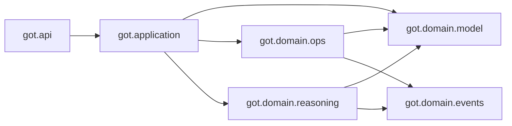

# Components

Map of packages that participate in a running request or library call. Empty scaffolding is listed at the end so it is not mistaken for a live dependency.

## Interface: `got/api`

| Symbol | File | Role |
|--------|------|------|
| `create_app`, `app` | `got/api/app.py` | FastAPI factory; loads `.env`; mounts the analysis router |
| `analyze_text` | `got/api/routes/analyze_text.py` | `POST /analyze-text`: text → graph → reasoning → DTOs |

There is no health route, CORS configuration, or auth middleware.

## Application: `got/application`

### Use cases

| Class | File | Role |
|-------|------|------|
| `CreateGraphFromTextUseCase` | `use_cases/create_graph_from_text.py` | Delegates to `StructureTextServiceLLM.from_text` |
| `ValidateAndPropagateGraphUseCase` | `use_cases/validate_and_propagate_graph.py` | Always validates, then always propagates (epistemic, optionally causal) |
| `AnalyzeGraphUseCase` | `use_cases/analyze_graph.py` | Delegates to `AnalysisService.analyze` |
| `AnalyzeReasoningUseCase` | `use_cases/analyze_reasoning.py` | Runs `ExecuteReasoningService`, builds `AnalysisSummaryDTO` |

`ValidateAndPropagateGraphUseCase` does **not** skip propagation when validation fails.

### Services

| Class | File | Role |
|-------|------|------|
| `OpenRouterClient` | `services/openrouter.py` | HTTP POST to OpenRouter; returns `choices[0].message.content` |
| `StructureTextServiceLLM` | `services/structure_text_service_llm.py` | Prompt → JSON → sanitize enums → `GraphSpecDTO` → domain `Graph` |
| `ExecuteReasoningService` | `services/execute_reasoning.py` | Validate+propagate, then optional analyze |

There is no `EnrichGraphService` or `QueryGraphService`.

### Schemas (DTOs)

| Class | File | Role |
|-------|------|------|
| `GraphSpecDTO`, `NodeSpecDTO`, `EdgeSpecDTO` | `schemas/graph_spec.py` | LLM JSON contract; checks edge and starting-node references |
| `GraphDTO`, `NodeDTO`, `EdgeDTO` | `schemas/graph.py` | API/library snapshot of a domain graph |
| `AnalysisSummaryDTO` | `schemas/analysis.py` | Compact counts + recommendation string |
| `ContradictionDTO`, `FullAnalysisDTO` | `schemas/analysis.py` | Defined; not used by `POST /analyze-text` |

## Domain model: `got/domain/model`

| Class | File | Role |
|-------|------|------|
| `Graph` | `model/graph.py` | Aggregate: node dict, edge list, version, timestamps, metadata |
| `Node` | `model/node.py` | Concept + type + confidence + metadata |
| `Edge` | `model/edge.py` | Directed relation; identity is `(source_id, target_id, relation_type)` |
| `NodeType` | `model/value_objects/node_type.py` | Eight node kinds |
| `RelationType` | `model/value_objects/relation_type.py` | 22 relations grouped into layers |
| `Confidence` | `model/value_objects/confidence.py` | Frozen float in `[0.0, 1.0]` |

Details: [../domain/model.md](../domain/model.md).

## Domain operations: `got/domain/ops`

Ops wrap `Graph` mutations and return domain events. They do not write an event store.

| Class | Mutates |
|-------|---------|
| `AddNode` | `Graph.add_node` |
| `AddEdge` | `Graph.add_edge` |
| `RemoveNode` | `Graph.remove_node` (also drops incident edges) |
| `RemoveEdge` | `graph.edges.remove` (no `Graph.remove_edge` method) |
| `UpdateNodeConfidence` | `Node.update_confidence` |

`merge_nodes.py` is empty and is not exported from `got.domain.ops`.

## Domain events: `got/domain/events`

| Event | Produced by |
|-------|-------------|
| `NodeCreated`, `NodeRemoved`, `NodeConfidenceUpdated` | corresponding ops |
| `EdgeAdded`, `EdgeRemoved` | corresponding ops |
| `CycleDetected` | `CausalValidator`, `StructuralValidator` (and constructor validation of the path) |
| `ContradictionDetected` | `EpistemicValidator` |
| `GraphUpdated` | Factory exists; no producer in ops or the API path |

`ValidationResult` can hold `CycleDetected` and `ContradictionDetected`. Ops return events to the caller; nothing in-tree subscribes.

## Structural reasoning engine: `got/domain/reasoning`

This package must remain free of LLM and I/O. See also [../../got/domain/reasoning/README.md](../../got/domain/reasoning/README.md).

### Validation

Orchestrator: `Validator` in `validation/validator.py`.

| Validator | Layer | What it does |
|-----------|-------|----------------|
| `CausalValidator` | causal | Causal cycles (warning + `CycleDetected`); `CAUSES`/`REQUIRES`/… vs `FOLLOWS` on the same pair (warning) |
| `EpistemicValidator` | epistemic | Direct `CONTRADICTS` (violation); opposing epistemic pairs; evidence-for+against; confidence vs support/weaken counts |
| `StructuralValidator` | structural | Hierarchical cycles; anti-symmetry; 2-step transitivity gaps; missing inverses; circular INSTANCE_OF/TYPE_OF; SIMILAR_TO asymmetry |

There is no dedicated temporal or logical validator class. Temporal checks live inside `CausalValidator`. `BLOCKS` and `IMPLIES` are not covered by a layer validator.

`ValidationReport` in `got/domain/reasoning/violations.py` is unused. Live code uses `ValidationResult`.

`validation/__init__.py` exports `CausalValidator` but not `EpistemicValidator` or `StructuralValidator`. Both are still constructed inside `Validator`.

### Propagation

Orchestrator: `PropagationService` in `propagation/propagation.py`.

| Propagator | Edges traversed | Effect |
|------------|-----------------|--------|
| `EpistemicPropagator` | outgoing edges where `relation_type.is_epistemic()` | strengthen or weaken target confidence by a factor (default `0.1`), BFS, each node once |
| `CausalPropagator` | outgoing edges where `relation_type.is_causal()` | same pattern on causal relations |

`propagate_all` runs epistemic then causal. Both mutate the graph in place and do not add or remove nodes/edges.

`IMPLIES` and `BLOCKS` appear in epistemic propagator lookup sets but are skipped because `is_epistemic()` is false for them.

### Analysis

Orchestrator: `AnalysisService`.

| Analyzer | Output |
|----------|--------|
| `ContradictionDetector` | `ContradictionCluster` list (direct contradicts, belief conflicts, evidence conflicts) |
| `ConnectivityAnalyzer` | Undirected connected components and isolated nodes |
| `CriticalPathAnalyzer` | Reverse BFS of supporting relations into a target |

`AnalysisService.analyze()` runs contradictions + connectivity only. Critical paths require `analyze_critical_paths()`.

`ConnectivityAnalyzer` docstring mentions articulation points and cycles; the implementation computes components and isolated nodes only.

## Communication rules

- Application coordinates; it should not reimplement validation or propagation rules.
- Domain ops are the intended mutation API. `StructureTextServiceLLM` currently bypasses them when constructing from LLM JSON.
- Validators are non-destructive. Propagators are destructive to `Node.confidence` only.

## Empty packages (do not wire new features here by default)

Until they contain implementations, treat these as unused:

- `got/domain/ports/`
- `got/infrastructure/`
- `got/interface/`

New persistence or LLM adapters should be designed against current application services first, or introduce ports **and** wire them. Empty port files are not a working hexagonal boundary.
