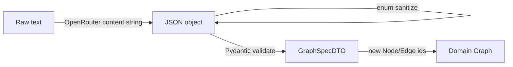

# Data flow

How graph state and DTOs move through the system. Control flow of the two live pipelines is in [execution-flow.md](execution-flow.md).

## Canonical state

The only canonical reasoning state is an in-memory `Graph`:

- `nodes: dict[str, Node]` keyed by node id
- `edges: list[Edge]`
- `version: int` (not incremented by current ops)
- `created_at` / `updated_at`
- `metadata: dict`

There is no repository, JSON store, or serialization path used at runtime. `GraphDTO` is a snapshot for API responses and can round-trip via `GraphDTO.to_domain()`, but the HTTP handler never reads a graph back from the client.

## LLM boundary: text → `GraphSpecDTO` → `Graph`

1. `OpenRouterClient.chat_json` returns a string (expected JSON).
2. `json.loads` parses it.
3. `StructureTextServiceLLM._sanitize_llm_spec` rewrites unknown `node_type` / `relation_type` values using alias tables, then falls back to `"concept"` / `"supports"`.
4. `GraphSpecDTO.model_validate` enforces types, confidence bounds, and referential integrity (`starting_node_ids` and edge endpoints must exist in `nodes`).
5. Construction allocates **new** `uuid4` node ids. Spec ids are kept only in a local `id_map`. Spec `starting_node_ids` are remapped; unknown spec ids are skipped after validation (validation already forbids unknown starting ids).

LLM-assigned ids never become domain ids.

## API snapshot: `Graph` → `GraphDTO`

`GraphDTO.from_domain` copies:

- node: `id`, `concept`, `node_type`, `confidence` as float, `metadata`
- edge: `source_id`, `target_id`, `relation_type`, `confidence` as float, `metadata`
- graph `metadata`

Not copied: `Graph.version`, timestamps, `Node.created_at`, `Edge.created_at` / `updated_at`.

`POST /analyze-text` does not return `starting_node_ids`.

## Confidence updates

Propagation walks outgoing edges from `starting_node_ids` (BFS, visit-once).

| Direction | Relation set | Target confidence |
|-----------|--------------|-------------------|
| Epistemic strengthen | `STRENGTHENS`, `SUPPORTS`, `EVIDENCE_FOR`, `EXPLAINS` (and `IMPLIES` in the set but not traversed) | `strengthen(factor)` |
| Epistemic weaken | `WEAKENS`, `EVIDENCE_AGAINST`, `CONTRADICTS` (and `BLOCKS` in the set but not traversed) | `weaken(factor)` |
| Causal strengthen | `CAUSES`, `REQUIRES`, `DEPENDS_ON`, `ENABLES` | `strengthen(factor)` |
| Causal weaken | `PREVENTS` | `weaken(factor)` |

Default `factor` is `0.1`. Source node confidence is not mixed into the delta; only the target is bumped. Edge confidence is unused during propagation.

`Confidence` is immutable: `strengthen` / `weaken` return a new instance; `Node.update_confidence` replaces the field.

## Analysis data

`AnalysisResult` contains:

- `contradiction_clusters: list[ContradictionCluster]`
- `connectivity: ConnectivityResult | None`
- `critical_paths: dict[str, CriticalPathsResult]` — empty after `analyze()`

The HTTP summary (`AnalysisSummaryDTO`) currently uses only `len(contradiction_clusters)`. `blocked_paths` and `viable_paths` are hardcoded to `0`. `simple_recommendation` therefore almost always returns `"Some paths exist but the reasoning contains inconsistencies."` because both path counts are zero.

Edge identifiers in clusters are strings `source_id:target_id:relation_type`, not a stored `Edge` id field (edges have no separate id attribute).

## Events

Ops return frozen dataclasses. Validators append events onto `ValidationResult.events` and optionally call `event_handler`. The API discards op events (LLM path does not use ops) and does not serialize `ValidationResult` to the client—only `GraphDTO` and `AnalysisSummaryDTO`.
