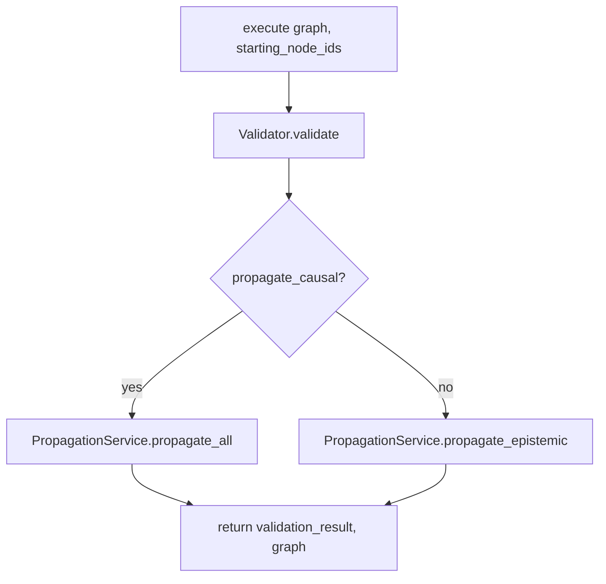

# Execution flows

Two live entry points exist: the HTTP API and in-process Python. Both end in the same structural engine. There is no retry loop, no transactional outbox, and no restart recovery: process death drops in-memory graphs.

## 1. HTTP: `POST /analyze-text`

**Trigger:** HTTP POST with JSON `{ "text": "..." }` (`text` min length 1).

**Owner:** `got.api.routes.analyze_text.analyze_text`.

```mermaid
sequenceDiagram
    participant Client
    participant Route as analyze_text
    participant Create as CreateGraphFromTextUseCase
    participant LLM as StructureTextServiceLLM
    participant OR as OpenRouterClient
    participant Analyze as AnalyzeReasoningUseCase
    participant Exec as ExecuteReasoningService
    participant VP as ValidateAndPropagateGraphUseCase
    participant AG as AnalyzeGraphUseCase

    Client->>Route: POST /analyze-text
    Route->>Create: execute(text)
    Create->>LLM: from_text(text)
    LLM->>OR: chat_json(temperature=0.0)
    OR-->>LLM: content string
    LLM-->>Create: Graph, starting_node_ids
    Create-->>Route: Graph, starting_node_ids
    Route->>Analyze: execute(graph, starting_node_ids, propagate_causal=False)
    Analyze->>Exec: run(...)
    Exec->>VP: execute(...)
    VP-->>Exec: validation, mutated graph
    Exec->>AG: execute(graph)
    AG-->>Exec: AnalysisResult
    Exec-->>Analyze: dict
    Analyze-->>Route: AnalyzeReasoningResult
    Route-->>Client: GraphDTO + AnalysisSummaryDTO
```

### State

- New `Graph()` per request.
- Nodes and edges created from the LLM spec (new UUIDs).
- Epistemic propagation mutates node confidence from `starting_node_ids`. Causal propagation is **off** on this route (`propagate_causal=False`).

### Side effects

- One outbound HTTPS request to `https://openrouter.ai/api/v1/chat/completions`.
- In-process mutation of the request-local graph.
- No disk writes, no logs, no metrics.

### Failures

| Failure | Handling |
|---------|----------|
| Missing `OPENROUTER_API_KEY` | `OpenRouterError`; uncaught by the route → FastAPI 500 |
| HTTP/network/shape errors from OpenRouter | `OpenRouterError` → 500 |
| Non-JSON LLM content | `ValueError` → 500 |
| Spec fails Pydantic / referential checks | Pydantic `ValidationError` → 500 |
| `CycleDetected` constructor rejects a reconstructed path | `ValueError` during validation → 500 |

There is no retry, timeout retry, or fallback structurer. OpenRouter timeout is 60 seconds (`OpenRouterClient.timeout_s`).

### Termination

The handler returns `AnalyzeTextResponse`. The graph is eligible for garbage collection after the response is built. Restarts do not resume requests.

## 2. Library: construct a graph and analyze

**Trigger:** Python code (see `examples/simple_sandbox.py`).

**Owner:** caller + `AnalyzeReasoningUseCase` (or `Validator` / `PropagationService` directly, as in the unit test).

Typical sequence:

1. `Graph()` then `AddNode.execute` / `AddEdge.execute` (events returned, usually ignored).
2. `AnalyzeReasoningUseCase.execute(graph, starting_node_ids, propagate_causal=False)`.
3. Same `ExecuteReasoningService` path as HTTP after graph construction.

No LLM is required. Failures are domain `ValueError` (duplicate node, missing endpoint, self-loop) or validation constructor errors, propagated to the caller.

## 3. Validate then propagate (shared)

**Owner:** `ValidateAndPropagateGraphUseCase`.



Validation is informative. Propagation **always** runs afterward, including when `is_valid` is false. Empty graphs yield a valid result with a warning `"Graph is empty - nothing to validate"`.

Default API/library analysis uses epistemic-only propagation.

## 4. Analysis after propagation

**Owner:** `AnalyzeGraphUseCase` → `AnalysisService.analyze`.

Runs `ContradictionDetector.detect` and `ConnectivityAnalyzer.analyze`. Does not call `CriticalPathAnalyzer`. The HTTP summary does not expose connectivity.

## What does not execute

- `got/infrastructure/**` and `got/domain/ports/**`
- `main.py` (unless invoked explicitly)
- Cursor `*-agent.mdc` personas (editor guidance only)
- Event store, graph repository, background workers
