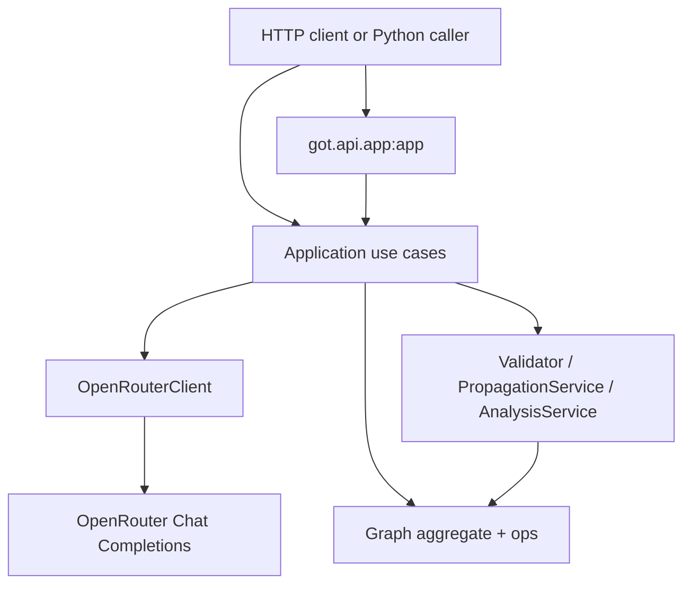

# System architecture

Graph-of-Thought (GoT) is an in-process Python reasoning engine. It represents reasoning as a typed graph (`Node`, `Edge`, `Graph`) and runs deterministic validation, confidence propagation, and analysis on that graph. A language model is used only to turn natural language into a `GraphSpecDTO`; it is not part of the reasoning core.

This document describes the **implemented** system. Planned or empty modules are listed explicitly.

## Problem the code actually solves

Callers can:

1. Build a `Graph` in Python with domain operations, or
2. POST text to `POST /analyze-text`, which asks OpenRouter for a JSON graph spec, builds a domain `Graph`, then validates, propagates confidence, and returns a DTO plus a compact analysis summary.

There is no database, no authentication, no job queue, and no cross-request persistence.

## Layered packages

The live code follows a three-layer layout:

| Layer | Package | Responsibility |
|-------|---------|----------------|
| Interface | `got/api` | FastAPI app, one HTTP route |
| Application | `got/application` | Use cases, LLM client, DTO mapping |
| Domain | `got/domain` | Graph aggregate, ops, events, structural reasoning |

`got.api` depends on application use cases. Application depends on domain. Domain does not import application or API. That import direction is verified in the source tree; it is not enforced by a linter rule.

## Runtime topology

Verified deployment surface:

- Local/dev process: `uv run uvicorn got.api.app:app --reload` loads `.env` via `python-dotenv` in `got/api/app.py`.
- CI: GitHub Actions workflow `.github/workflows/ci.yml` runs Ruff then pytest on Python 3.11. pytest is given `OPENROUTER_API_KEY=dummy`; the current test does not call OpenRouter.

There is no container definition, process manager, or hosted environment in this repository.

`main.py` prints `"Hello from graph-of-thought!"` and is not the application entry point.

## Implemented vs not

### Implemented

- Domain model: `Graph`, `Node`, `Edge`, `NodeType`, `RelationType`, `Confidence`
- Domain ops: `AddNode`, `AddEdge`, `RemoveNode`, `RemoveEdge`, `UpdateNodeConfidence`
- Domain events as return values / `ValidationResult.events`
- Structural engine: `Validator`, `PropagationService`, `AnalysisService`
- Application pipeline: text → graph spec → graph → validate/propagate → analyze
- HTTP: `POST /analyze-text`
- Example: `examples/simple_sandbox.py`
- Test: `got/tests/test_validation_propagation_flow.py`

### Partially implemented

- Analysis summary: `blocked_paths` and `viable_paths` are always `0` in `AnalyzeReasoningUseCase`
- `AnalysisService.analyze()` leaves `critical_paths` empty
- Domain events are created but not persisted or dispatched (except optional unused `event_handler` on validators)
- `StructureTextServiceLLM` instantiates `AddNode`/`AddEdge` then builds the graph with `Graph.add_node` / `Graph.add_edge` instead
- `Graph.version` / `increment_version()` exist; ops do not increment version
- `GraphUpdated` is defined and never emitted by ops

### Empty scaffolding (files exist, no behavior)

These modules are empty and are **not** on the live path:

- `got/domain/ports/` (`graph_repo.py`, `llm_interpreter.py`, `structurer.py`)
- `got/infrastructure/` (API, LLM, persistence, structuring)
- `got/interface/space_app.py`
- `got/domain/ops/merge_nodes.py`
- `got/domain/reasoning/validation/consistency_checker.py`
- `examples/basic.py`

### Cursor agent personas (not Python services)

Files in `.cursor/rules/*-agent.mdc` and `got-orchestrator.mdc` describe intended multi-agent roles (decomposition, research, pruning, …). There are no corresponding orchestrator classes or agent runtimes in `got/`.

### Declared but unused dependencies

- `networkx` is in `pyproject.toml` and never imported
- optional extras `openai` and `transformers` are unused; the LLM client uses `urllib.request`

## External systems

| System | Role | Code |
|--------|------|------|
| OpenRouter | Chat completions, JSON graph spec | `got/application/services/openrouter.py` |

No other external services are called.

## Next

- Module map: [components.md](components.md)
- Data shapes: [data-flow.md](data-flow.md)
- Traced pipelines: [execution-flow.md](execution-flow.md)
