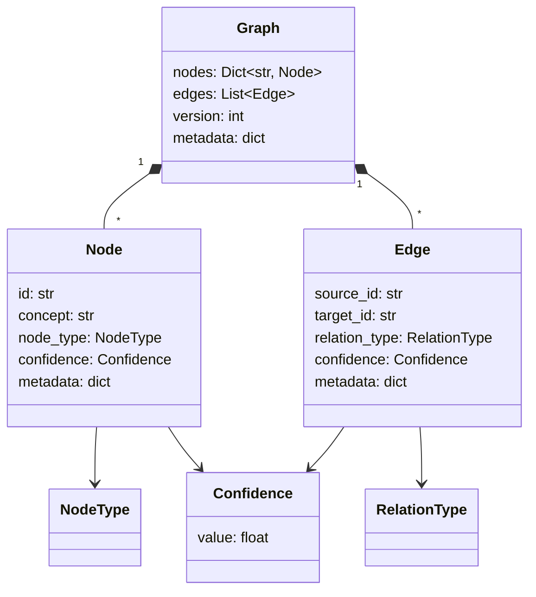

# Domain model

The domain models reasoning as a directed, typed graph. The aggregate root is `Graph`. Language models are not part of this package.

## Entities and value objects

### `Graph`

File: `got/domain/model/graph.py`.

Owns nodes and edges. Enforces that edges only connect existing nodes and that an edge identity is unique in the list. Removing a node removes incident edges. `get_neighbors` treats the graph as undirected for connectivity.

Layer helpers (`get_causal_edges`, `get_epistemic_edges`, …) delegate to `Edge.get_layer()` / `RelationType.get_layer()`.

### `Node`

File: `got/domain/model/node.py`.

Atomic unit of thought. `concept` must be non-empty after strip. Default id is `uuid4`. Default type `CONCEPT`, default confidence `0.5`. Equality and hash are by `id` only.

### `Edge`

File: `got/domain/model/edge.py`.

Directed relation. Cannot be a self-loop. Equality and hash are `(source_id, target_id, relation_type)` — not confidence. There is no dedicated edge id field.

### `NodeType`

File: `got/domain/model/value_objects/node_type.py`.

`CONCEPT`, `HYPOTHESIS`, `FACT`, `GOAL`, `STATE`, `PROBLEM`, `SOLUTION`, `CONSTRAINT`.

The enum does not constrain which relations may attach to which types.

### `RelationType`

File: `got/domain/model/value_objects/relation_type.py`.

22 members in five layers:

| Layer | Members |
|-------|---------|
| causal | `CAUSES`, `REQUIRES`, `DEPENDS_ON`, `ENABLES`, `PREVENTS` |
| logical | `IMPLIES`, `SUPPORTS`, `CONTRADICTS`, `BLOCKS` |
| epistemic | `SUPPORTS`, `CONTRADICTS`, `WEAKENS`, `STRENGTHENS`, `EVIDENCE_FOR`, `EVIDENCE_AGAINST`, `EXPLAINS` |
| structural | `CONTAINS`, `PART_OF`, `SIMILAR_TO`, `INSTANCE_OF`, `TYPE_OF`, `IMPLEMENTS` |
| temporal | `PRECEDES`, `FOLLOWS` |

`SUPPORTS` and `CONTRADICTS` are both logical and epistemic. `get_layer()` checks causal, then epistemic, then structural, then temporal, else logical — so those two are classified as **epistemic**. `IMPLIES` and `BLOCKS` are logical only.

### `Confidence`

File: `got/domain/model/value_objects/confidence.py`.

Frozen value object, `0.0 ≤ value ≤ 1.0`. Code comments state this is epistemic belief, not a statistical probability and not model accuracy. `weaken` / `strengthen` clamp to `[0.0, 1.0]` and return a new instance.

## Operations

Files under `got/domain/ops/`. Intended mutation API for application code and examples.

Each `execute` creates or reads domain objects, mutates the graph, returns an event. Failures raise `ValueError` and leave the graph unchanged for add/remove node/edge **if** the error happens before the mutation (duplicate node, missing node, missing edge). `RemoveNode` drops edges as part of `Graph.remove_node`.

## Events

Files under `got/domain/events/`. Frozen dataclasses for audit. They are not appended to the graph. See [../architecture/components.md](../architecture/components.md).

`CycleDetected` validates that `cycle_path` starts and ends on the same id, has at least two distinct nodes, and `len(path) == len(unique) + 1`. Invalid reconstructions raise at event construction time.

## Structural engine types

Not graph entities, but domain results:

- `ValidationResult` — `is_valid`, string `violations` / `warnings`, events
- `ContradictionCluster`, `ConnectivityResult`, `SupportPath`, `CriticalPathsResult`, `AnalysisResult`

`ValidationViolation` / `ValidationReport` in `got/domain/reasoning/violations.py` are unused.

## Ownership and lifecycle

- A `Graph` instance is the consistency boundary. There is no unit of work beyond one Python object.
- Node ids are unique within a graph (`add_node` rejects duplicates). They are not globally unique across graphs except by UUID chance.
- LLM construction always mints new node ids.
- Graphs are not saved. Lifecycle is the process or HTTP request.

## What the model does not include

- Persistence, users, sessions, or multi-graph catalogs
- Typed edge identifiers
- Node-type × relation-type compatibility matrix
- Implemented `MergeNodes`
